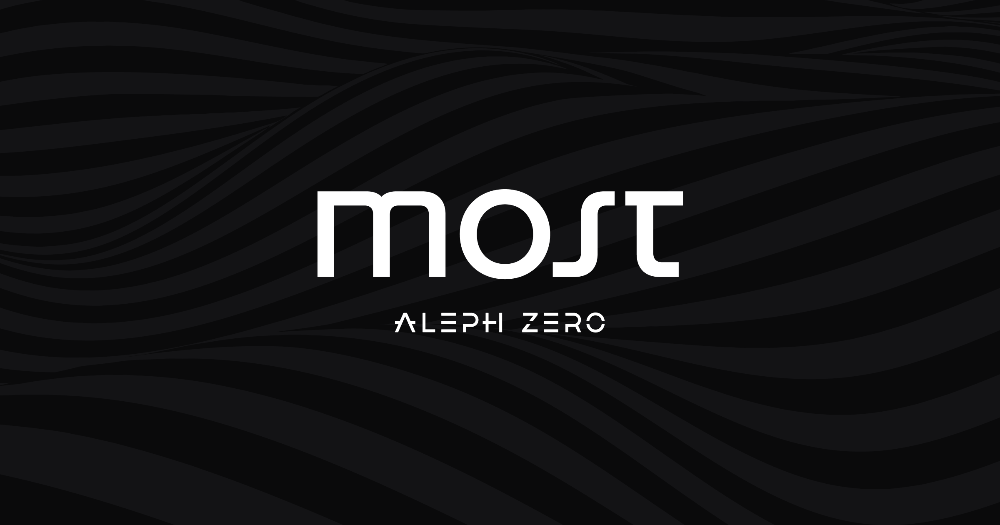

[](https://github.com/paritytech/ink)



# Aleph Zero MOST<sup>*</sup> (Guardian) Bridge

Bring your assets to Aleph Zero and benefit from its scalable privacy-enhancing ecosystem.

<sup>_\*'bridge' in Slavic languages._</sup>

## Contents

* `azero` - Aleph Zero contracts
  * `azero/contracts/most` - the main bridge contract
  * `azero/contracts/gas-price-oracle` - a contract for informing the guardians about Ethereum gas prices
  * `azero/contracts/token` - a PSP22 token implementation for the tokens created by the bridge
* `eth` - Ethereum contracts
  * `eth/contracts/Most.sol` - the main bridge contract
  * `eth/contracts/Governance.sol` - a contract for making governance decisions about the bridge contracts on Ethereum
  * `eth/contracts/WETH9.sol` - a wrapped ethereum implementation for testing purposes
  * `eth/contract/Token.sol` - an ERC20 token implementation for testing purposes
* `relayer` - the component doing the actual bridging between the chains

## Prerequisites

1. Have docker and docker-compose (`1.29.2`)
2. Have cargo-contract (`3.2.0`) installed:

```bash
cargo install cargo-contract --vers 3.2.0
```

## Testing the contracts

### Solidity contracts

To run the tests for the Solidity `Most.sol` contract, run:

```bash
make test-solidity
```

It will run the tests using the Hardhat framework.
Alternatively, you can run the tests directly from the selected file in the `eth` directory, for example:

```bash
cd eth
npx hardhat test test/Most.js
```

### Ink! contracts

#### Unit tests

To run the unit tests for the ink! contracts, run:

```bash
make test-ink-unit
```

These will allow you to test the contracts in isolation, without the need for running a blockchain node in the background.

#### DRink! tests

To run DRink! based tests, which allow for testing interactions between multiple contracts without the need to run a node, run:

```bash
make drink-tests
```
DRink! tests are located in `azero/contracts/drink-tests/`.

### ink_e2e tests

To run the end-to-end tests for the ink! `most` contracts, run (requires docker-compose `1.29.2`):

```bash
make test-ink-e2e
```
These tests are located at `azero/contracts/tests`.

## Running the local development environment

To run a local development environment, run:

```bash
make bridge
```

This will start a local development environment with the following components:
* Aleph Zero Development chain
* Ethereum PoS Development chain
* Bridge contracts deployed on both chains
* Redis instance
* Relayer process

## Running local development chains

To run the development chain without deploying the contracts or running the relayer, run:

```bash
make devnet-eth
```
or
```bash
make devnet-azero
```

## Running a relayer with a signer locally

First, run the signer:

```bash
cd relayer
RELAYER_ID=1 scripts/run_signer.sh
```

The signer will output the CID on which it is running, but you should also be able to just use 2 (meaning host) as the CID.

Next, run the relayer, passing the signer CID to connect to:

```bash
# in most/relayer
SIGNER_CID=2 scripts/run_relayer.sh
```

## Cleaning up

To stop the networks (and redis) and clean up:

```bash
make clean
```

### Check eth nodes connectivity

get a shell into running container:

```bash
docker exec -it eth_bootnode "geth attach /root/.ethereum/geth.ipc"
```

attach console to the geth process:

```bash
geth attach /root/.ethereum/geth.ipc
```

Check the connected peers, confirm these are the correct nodes:

```bash
net.peerCount
admin.peers
```

## Deploying contracts

To deploy the contracts on the EVM chain:

```bash
make deploy-eth
```

This command will deploy the contracts and print out the contract addresses.

Now, open a Hardhat console:

```bash
cd eth && npx hardhat console --network development
```

Interact with the deployed contracts instance:

```javascript
let Most = await ethers.getContractFactory("Most")
let most = Most.attach("insert contract address here")
let accounts = await ethers.getSigners();

await most.isGuardian(accounts[0])
await most.isGuardian(accounts[1])
```

To deploy the contracts on the Aleph Zero chain:

```bash
make deploy-azero
```

## Running the relayer processes

```bash
make run-relayers
```

## Verifying deployed contracts against source code

Given a deployed (by us) Aleph Zero contract with some code hash `C` it's possible to check that the contract has been
produced from a certain version of the source code in this repo (say a given commit). To do so:

1. `git checkout $COMMIT`
2. `make print-azero-codehashes`
3. Find the contract in question in the list and ensure that the printed code hash is the same as `C`

The contracts will be deployed using the same docker image as the one used for this procedure, which smooths out
indeterminism in ink! contract compilation.

## Verifying deployed contracts on etherscan

Given a deployed Ethereum contract address it's possible to post verified sources to etherscan and sourcify. You will
need an API key for etherscan - can be obtained at https://etherscan.io/myapikey if you have an account. To do so:

1. `git checkout $COMMIT` - where `$COMMIT` is the commit from which the contract has been deployed
2. `cd eth`
3. `ETHERSCAN_API_KEY=[YOUR API KEY] npx hardhat verify [CONTRACT ADDRESS] [CONSTRUCTOR ARGS]`

For example, if you deploy `Token.sol` to the sepolia testnet like so:

```js
const usdt = await Token.deploy(
  "12000000000000000000000000",
  "Tether",
  "USDT",
);
```

and the address is `0xbd737D2061ed3b24C95FA88566Ad896c9Fcc84b0`, then you would post verified sources like so:

```bash
ETHERSCAN_API_KEY=[YOUR API KEY] npx hardhat --network sepolia verify "0xbd737D2061ed3b24C95FA88566Ad896c9Fcc84b0" \
  "12000000000000000000000000" "Tether" "USDT"
```

## Decoding a contract call on ethereum

Assuming a contract verified on etherscan, there's a convenience script to decode a call to that contract. Just call:

```bash
NETWORK=[NETWORK NAME] CALL=[CALL DATA] CONTRACT=[CONTRACT ADDRESS] make decode-eth
```

Valid values for `NETWORK` are `mainnet (default)`, `sepolia`, and `goerli`.

For example:

```bash
NETWORK=sepolia  \
  CALL=0x095ea7b30000000000000000000000005a344a8721d743393847c17613dd78c7776b271400000000000000000000000000000000000000000000000000000000000004d2 \
  CONTRACT=0x5a344a8721d743393847C17613dd78C7776b2714 \
  make decode-eth
```

gives:

```
Contract: Token
Method: approve(address,uint256)
Arguments: Result(2) [ '0x5a344a8721d743393847C17613dd78C7776b2714', 1234n ]
```

## Documentation

Additional documentation is written in orgmode, diagrams are written using [plantuml](https://plantuml.com/download).

Orgmode is suported by [VSCode](https://vscode-org-mode.github.io/vscode-org-mode), [Emacs](https://orgmode.org/) and [vim](https://github.com/jceb/vim-orgmode).

### Diagrams

In order to render the diagrams:

```bash
java -jar plantuml.jar azero_eth_components.iuml eth_azero_components.iuml
```

There are various online editors for plantuml that can render the format, e.g.:
- [plantuml-previewer](https://sujoyu.github.io/plantuml-previewer/)

In Emacs you can pass the path to the plantuml executable in the orgmode config:

```elisp
(setq org-plantuml-jar-path
      (expand-file-name "/path/to/plantuml.jar"))
```

Then you can use:

```
C-c C-e l p
```

to render the whole document and evaluate plantuml code blocks (this will produce png files).

## Acknowledgments

This project includes code from the following MIT-licensed project:

- [pancake-smart-contracts](https://github.com/pancakeswap/pancake-smart-contracts)
