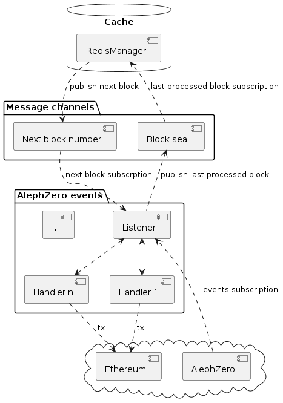
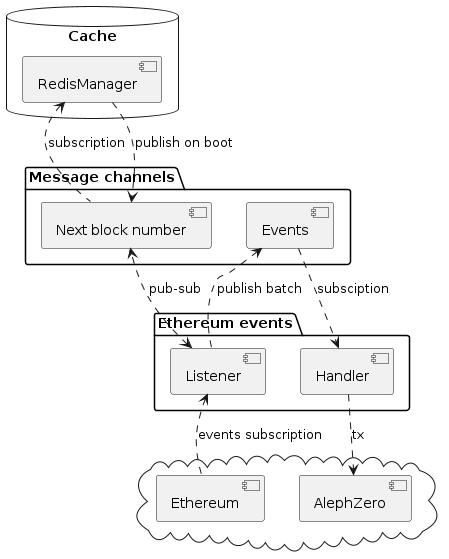

# Table of Contents

1.  [Introduction](#org787ba0a)
2.  [Components handling AlephZero -> Ethereum transfer requests](#org2834be9)
3.  [Components handling Ethereum -> AlephZero transfer requests](#orgc191780)
4.  [Additional components](#org293ad26)

# DONE Introduction

This document describes the conceptual design of a relayer process, designed to listen to, sign and relay cross-chain transfer requests between Ethereum and AlephZero.

System architecture can be divided into components responsible for listening to and handling requests coming from the AlephZero chain and into Ethereum, as well as the ones responsible for handling cross chain transfers in the opposite direction.

The system is composed of various coupled components which communicate via message-passing channels.

Because of the vast differences in how these two chains operate and finalize blocks there are some differences in how these two sides operate.

# DONE Components handling AlephZero -> Ethereum transfer requests

-   **Listener**: maintains a subscription to the AlephZero chain. On boot it will receive the number of the next block to process and filter all the cross-chain transfer request events that occurred between this cached number and the last finalized block. After that, requests are handled concurrently in chunks of events from consecutive block ranges. The cache is updated as the concurrent event handlers spawned for each batch finish processing them, in the same order the batches arrived and were queued.
-   **Handlers**: independent event handlers that are spawned for each request. After all the events from the batch of blocks acknowledge they have finished the cache gets updated with the next block number.

Handlers sign and submit transactions to the MOST smart contract on the Ethereum chain, first by checking whether a given guardian signature is needed (maybe they already signed it, or maybe the request is already processed, or maybe some previous blocks were yanked). As long as it is needed in the last produced block on Ethereum, the handler will sign it and wait until the transaction appears in the last finalized block. The following pseudo-code is a conceptual representation of the exact logic followed by the handlers before acknowledging a cross-chain transfer request as handled:

    do:
      if !request_needs_signing(@latest_block):
        sleep(60);
        continue;
      else
        sign_request()
    while request_needs_signing(@finalized_block)

# DONE Components handling Ethereum -> AlephZero transfer requests

-   **Listener**: maintains a subscription to the Ethereum chain. On boot it receives next block number after the last cached and proceeds to retrieve events in batches coming from consecutive blocks, between the last processed and the last finalized, whichever number is smaller. For each batch **Listener** publishes it on an Events channel for a **Handler** to pick up and process in a blokciing manner, i.e. the **Listener** doe snot process further until the current batch is entirely handled and the cache is updated.
-   **Handler**: a task which subscribes to the Events channels and acks whenever a given batch of transfer requests is successfully handled. Each event in a batch is processed sequentially in a FIFO order.

# DONE Additional components

There are various ancillary components not part of the diagrams above:

-   **Circuit Breaker**: Ciruit Breaker is a multiple-producer multiple-consumer channel, a message pushed to this channels by one of the components makes the remaining components drop all their tasks immediately, which returns control to the main thread. The relayer enters a shutdown/reboot loop, in which state the system tries to handle the next batch of requests, starting from the last successfully processed block, until the condition is removed.
-   **Advisory Listener**: this is a process that listens to none, one or a collection of Advisory smart contracts, which are boolean flag contracts, deployed on the AlephZero chain, where interested parties can publish warnings that shut down the relayer operation. Notice that the smart contracts comprising the MOST do not observe these flags, only the relayer process does. If the Advisory Listener detects a flag it publishes to the circuit breaker channel.
-   **Halted state Listener**: Twin processes that check whether the bridge on their side has beeen halted by a governance action. Detecting it means an event is published to the circuit breaker channel.
-   **Signer**: a separate process responsible for signing cross-chain request transaction payloads with a key stored within a hardware enclave.
